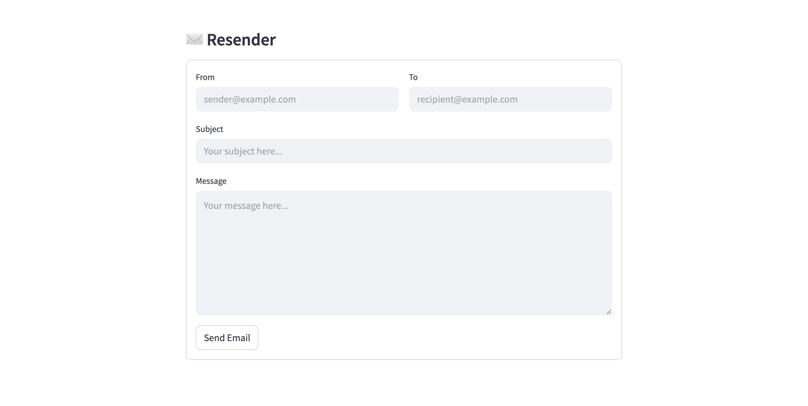

# resend
A sample [Streamlit](https://streamlit.io/) web application for sending emails using [Resend](https://resend.com/).



## Installation
To run this application locally, you'll need to have Python 3.x installed on your machine. You can clone this repository and install the required Python packages by running the following commands:
```
git clone https://github.com/alphasec/resend.git
cd resend
pip install -r requirements.txt
```

## Configuration
To use the Resend email service, you'll need to provide the API key as a `RESEND_API_KEY` environment variable. You can obtain your Resend API key by signing up for an account at [Resend](https://resend.com), and configuring the sending domain.

## Usage
To run the application, execute the following command:
```
streamlit run streamlit_app.py 
```
## Templates
To deploy using a one-click starter template on [Railway](https://railway.app/?referralCode=alphasec), click the button below.

[](https://railway.app/new/template/D-9Vm5?referralCode=alphasec)
